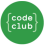

    

# { perifaCode }

> A comunidade de programação da periferia!

Aqui reunimos pessoas que moram em periferias, favelas e guetos do Brasil para criar uma rede de apoio para conseguirmos vencer as barreiras sociais que nos limitam a entrada ou evolução na área de programação.

## Sumário

- [Missão](#missão)
- [Como participar](#como-participar)
- [Nossas redes sociais](#nossas-redes-sociais)
- [Nosso conteúdo](#nosso-conteúdo)
- [Organização](#organização)
- [Iniciativas que apoiamos](#iniciativas-que-apoiamos)

## Missão

Nossa missão é **inserir pessoas de origem periférica na área de programação**.

Sabemos que a área de desenvolvimento de software é grande e continua crescendo. É uma área de acesso democrático, pois o conteúdo necessário para trabalhar com isso está (quase sempre) livre e aberto na internet, mas para pessoas periféricas, com menos acesso a informação, ainda falta um certo apoio.

Como comunidade nós focamos em inserir essas pessoas o mais rápido no mercado de trabalho, pois temos a vivência de pessoas que vieram da periferia e confirmamos que depois que entramos nesta área a nossa vida mudou 100%.

Nós estamos aqui para levar a informação para a periferia e servir de grupo de apoio para que essas pessoas tenham as oportunidades que não tiveram ainda para chegar nesse universo.

## Como participar

1. Você deve ler nosso [código de conduta](https://perifacode.com/COC)
2. Se cadastrar na comunidade através deste formulário: [perifaCode - cadastro](http://bit.ly/cadastro-perifacode)
3. No final do cadastramento você receberá o link de acesso ao nosso grupo do Telegram.

Em nosso grupo falamos sobre temas diversos e discutimos ideias sobre o futuro da nossa comunidade, bem como eventos, cursos e ideias que podem apoiar gente como a gente.

Caso você queira sugerir qualquer coisa, pode abrir uma issue neste repositório ou enviar um email para contato@perifacode.com.
Se você se sentir mais à vontade ou for mais fácil, pode deixar um post no nosso [fórum](https://forum.perifacode.com) que damos um jeito :blush:

## Nossas redes sociais

- [Twitter](https://twitter.com/perifacode)
- [Facebook](https://facebook.com/perifacode)
- [Instagram](https://www.instagram.com/perifacode)

## Nosso conteúdo

- [YouTube](https://www.youtube.com/c/perifaCode)
- [Fórum](https://forum.perifacode.com)

## Organização

Time de pessoas que cuida do perifaCode.

- Andressa Neves: [@AndressaCPNeves](https://twitter.com/AndressaCPNeves)
- Luís Ângelo: [@luisangelorjr](https://twitter.com/luisangelorjr)
- Fabiana Rodrigues: [@frontfabijs](https://twitter.com/frontfabijs)
- Bruna Santos: [@brunachris31](https://twitter.com/brunachris31)
- Glauber Castro: [@glauberacastro](https://twitter.com/glauberacastro)
- Luke Silva: [@cephalopodluke](https://twitter.com/cephalopodluke)
- Guilherme Vieira: [@gitlherme](https://twitter.com/gitlherme)
- Kamila Oliveira: [@kamilah_santos](https://twitter.com/kamilah_santos)
- Melanie Miranda: [@meninah](https://instagram.com/meninah.dev)
- Letícia Ferreira
- Anderson Portela: [@andersportela](https://twitter.com/andersportela)
- Carla Vieira: [@carlaprvieira](https://twitter.com/carlaprvieira)
- Bruna Lanzarini
- Brenda Xavier
- Éber Freitas: [@eber_freitas](https://twitter.com/eber_freitas)
- William Oliveira: [@w_oliveiras](https://twitter.com/w_oliveiras)

Caso você queira entrar em contato para parcerias ou denúncias: [contato@perifacode.com](mailto:contato@perifacode.com)

## Iniciativas que apoiamos

Existem projetos extremamente maneiros que acreditamos que você deveria conhecer:

    
    
    
    
    

