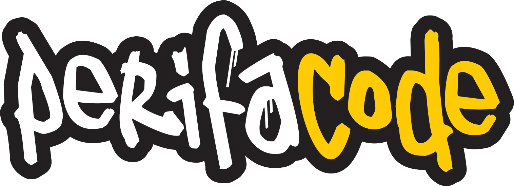

    

# { perifaCode }

> Comunidade de programação para pessoas de região ou origem periférica.

Aqui reunimos pessoas que moram em periferias, favelas e guetos do Brasil para criar uma rede de apoio para conseguirmos vencer as barreiras sociais que nos limitam a entrada ou evolução na área de programação.

## Missão

Conectar pessoas de origem periférica, para que compartilhemos experiências, projetos, iniciativas (cursos, workshops, bootcamps), **vagas**, conteúdo (podcasts, vídeos, artigos, músicas) relacionado a programação ou cultura do gueto.

## Como participar

Você deve ler nosso [código de conduta](CONDUCT.md) e depois entrar no nosso grupo no [Telegram](http://bit.ly/perifacode-group).

Caso você queira sugerir qualquer coisa, pode abrir uma issue neste repositório ou enviar um email para contato@perifacode.com.

## Talvez você goste de conhecer

Existem projetos extremamente maneiros que acreditamos que você deveria conhecer:

    
    
    
    

